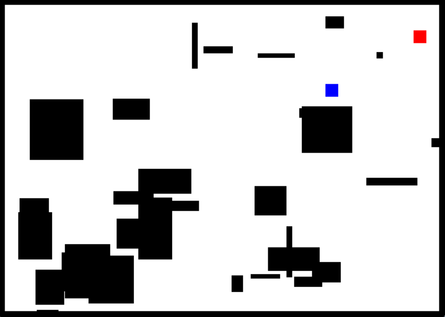

# Coding Sessions
- weekly Coding Sessions without a specific topic

## Session 1
- image of the project: 
- blue box is player
- red box is enemy
- Player can move with arrow keys
- Player can shoot the enemy with mouse or spacebar
- walls are randomly generated
- if the player touches a wall, he dies
